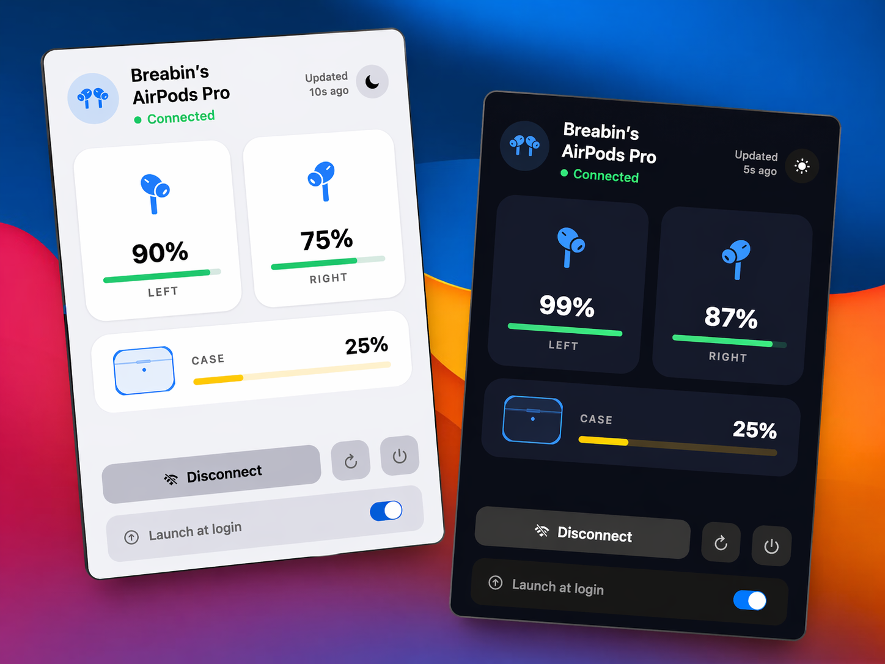
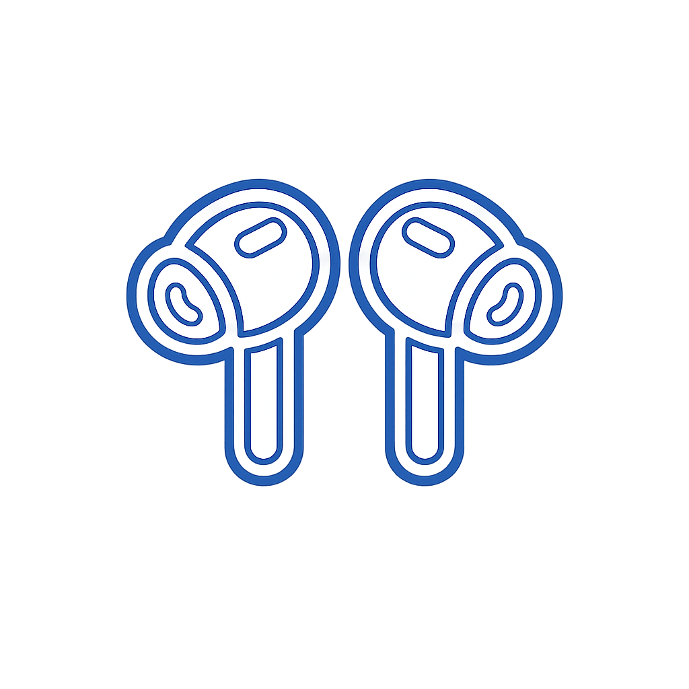
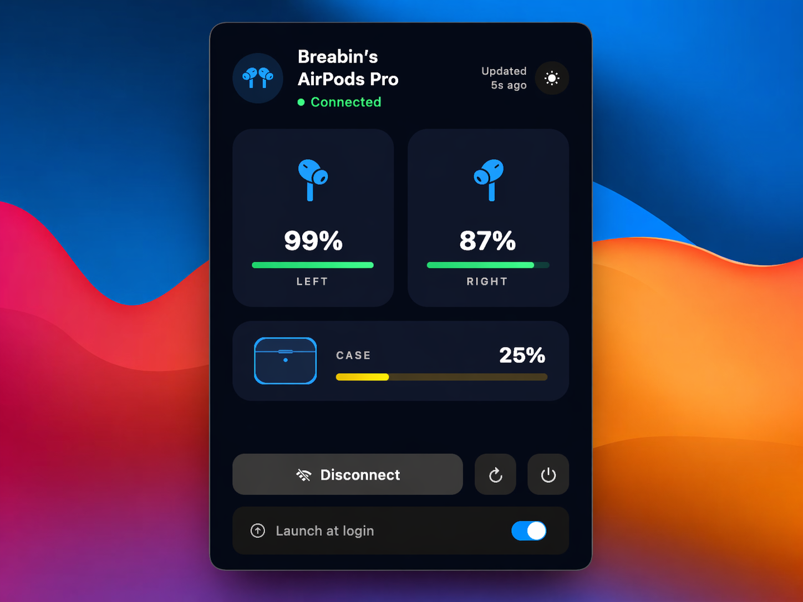

# 🎧 AirPodsBar

A native macOS menu bar app that displays your AirPods battery levels in real time.



---

## Features

- Displays battery for **left earbud**, **right earbud**, and **case**
- Shows whether earbuds are **in-ear** (in-ear detection)
- Indicates when earbuds or case are **charging**
- **Connect / Disconnect** your AirPods directly from the menu bar
- **Launches at startup** automatically
- Refreshes every **30 seconds**

---

## Screenshots

| Menu Bar | Popover |
|----------|---------|
|  |  |

---

## Requirements

- macOS 12 Monterey or later
- Xcode 14+
- [Homebrew](https://brew.sh) (for `blueutil`)
- AirPods connected via Bluetooth

---

## Installation

### Step 1 — Install blueutil (required for connect/disconnect)

```bash
brew install blueutil
```

### Step 2 — Open the project in Xcode

```bash
open AirPodsBar.xcodeproj
```

### Step 3 — Build & Run

1. In Xcode: **Product → Run** (⌘R)
2. On first launch, approve the Bluetooth permission prompt

### Step 4 — Move to Applications (required for startup)

```bash
# Build a Release version from terminal:
xcodebuild -project AirPodsBar.xcodeproj -scheme AirPodsBar -configuration Release build

# Copy the .app to Applications:
cp -R build/Release/AirPodsBar.app /Applications/
```

Or use **Product → Archive → Distribute App → Copy App** inside Xcode.

### Step 5 — Enable launch at startup

```bash
cp com.vik.airpodsbar.plist ~/Library/LaunchAgents/
launchctl load ~/Library/LaunchAgents/com.vik.airpodsbar.plist
```

To disable startup:

```bash
launchctl unload ~/Library/LaunchAgents/com.vik.airpodsbar.plist
```

---

## Troubleshooting

**Battery shows "--"**
- Make sure your AirPods are connected to your Mac
- Try clicking the Refresh button (↻)
- macOS only reports battery data when the earbuds are active

**Connect/Disconnect doesn't work**
- Verify `blueutil` is installed: `which blueutil`
- Apple Silicon (M1/M2/M3): path is `/opt/homebrew/bin/blueutil`
- Intel Mac: path is `/usr/local/bin/blueutil`

**App doesn't launch at startup**
- Make sure the app is at `/Applications/AirPodsBar.app`
- Re-run: `launchctl load ~/Library/LaunchAgents/com.vik.airpodsbar.plist`

---

## Project structure

```
AirPodsBar/
├── AirPodsBar.xcodeproj/
├── AirPodsBar/
│   ├── AirPodsBarApp.swift       # @main entry point
│   ├── AppDelegate.swift          # Menu bar + popover management
│   ├── BatteryMonitor.swift       # IORegistry + blueutil integration
│   ├── ContentView.swift          # SwiftUI UI
│   └── AirPodsBar.entitlements   # Bluetooth permissions
├── com.vik.airpodsbar.plist      # LaunchAgent for startup
└── install.sh                    # Quick install script
```

---

## License

MIT — feel free to use, modify, and distribute.

---

Made with ❤️ for macOS
