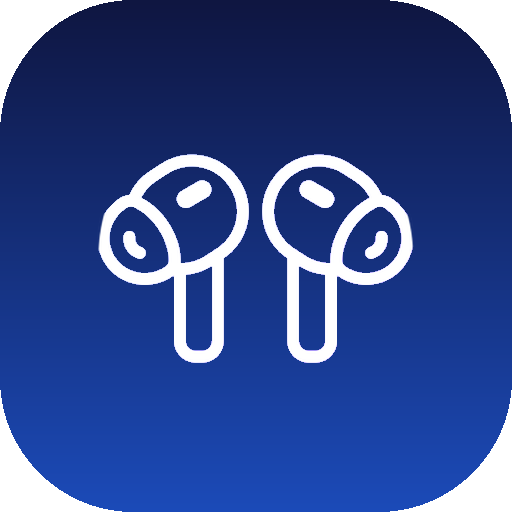

<div align="center">



# AirPodsBar

**A lightweight, native macOS menu bar app for real-time AirPods Pro battery monitoring.**

[](https://github.com/VIK-DD/AirPodsBar/releases/latest)
[](https://www.apple.com/macos/)
[](https://swift.org)


[](LICENSE)

<br />


</div>

---

## About

AirPodsBar lives in your macOS menu bar and gives you instant visibility into your AirPods Pro battery — left earbud, right earbud, and charging case — without opening any app or settings panel.

Built entirely with native Swift and SwiftUI. No Electron. No Homebrew. No background services hogging your RAM. Just a small, fast, native app that does one thing well.

---

## Features

| | |
|---|---|
| 🔋 **Real-time battery** | Left, right, and case levels updated every 30 seconds |
| 🟢 **In-case detection** | Green indicator when an earbud is tucked in the case |
| 🔔 **Low battery alerts** | Native macOS notification when any component drops below 20% |
| 💡 **Hover tooltip** | See all battery levels just by hovering the menu bar icon |
| 🔗 **Connect / Disconnect** | Pair or unpair directly from the menu — no System Settings needed |
| 🌓 **Dark & Light theme** | Toggle with one click, saved automatically |
| 🚀 **Launch at login** | Toggle in the UI, no Terminal required |
| ⚡ **Instant on open** | Data refreshes the moment you click the icon |
| 🧩 **Zero dependencies** | Uses native `IOBluetooth` and `system_profiler` |

---

## Installation

### Download (recommended)

1. Download **[AirPodsBar.dmg](https://github.com/VIK-DD/AirPodsBar/releases/latest)** from the latest release
2. Open the DMG and drag **AirPodsBar** into your **Applications** folder
3. Launch it — the 🎧 icon appears in your menu bar

> **First launch:** macOS may show a security warning since the app is not notarized.
> Right-click the app → **Open** → **Open** to proceed.

### Build from Source

**Requirements:** macOS 12+ · Xcode Command Line Tools

```bash
# 1. Install Xcode Command Line Tools (skip if already installed)
xcode-select --install

# 2. Clone the repo
git clone https://github.com/VIK-DD/AirPodsBar.git
cd AirPodsBar

# 3. Build and install
bash install.sh
```

The script auto-detects your architecture (Intel or Apple Silicon), compiles all Swift sources, creates the app bundle, installs it to `/Applications`, and sets up the LaunchAgent for login startup.

---

## How It Works

macOS exposes AirPods battery data through `system_profiler SPBluetoothDataType`. AirPodsBar polls this every 30 seconds on a background thread and pushes updates to the SwiftUI interface.

**In-case detection** is definitive: if an earbud stops reporting battery while the case still reports its own level, that earbud is in the case.

**Charging detection** works by comparing consecutive battery readings — if a value increases between refreshes, the component is inferred to be charging. This is the most reliable approach available without private Apple APIs on macOS 12.

---

## Requirements

| | |
|---|---|
| **macOS** | 12.0 Monterey or later |
| **Chip** | Intel x86_64 or Apple Silicon arm64 |
| **AirPods** | AirPods Pro (1st or 2nd generation) |
| **Dependencies** | None |

---

## Project Structure

```
AirPodsBar/
├── AirPodsBar/
│   ├── main.swift             # App entry point
│   ├── AppDelegate.swift      # Menu bar icon, popover, event handling
│   ├── BatteryMonitor.swift   # Data fetching, charging inference, notifications
│   └── ContentView.swift      # SwiftUI interface
├── Assets/                    # Screenshots and icon for README
├── install.sh                 # Build + install script (for source builds)
├── create_dmg.sh              # Creates a distributable DMG after build
├── com.vik.airpodsbar.plist   # LaunchAgent for login startup
└── README.md
```

---

## Uninstall

```bash
pkill -x AirPodsBar
rm -rf /Applications/AirPodsBar.app
rm -f ~/Library/LaunchAgents/com.vik.airpodsbar.plist
```

---

## Known Limitations

- Charging status is **inferred** from battery delta between refreshes, not a direct hardware signal (macOS 12 does not expose charging state via public APIs)
- Case battery is only reported when at least one earbud is physically inside
- The app is not notarized — right-click → **Open** required on first launch
- Launch at login takes effect from the next login, not immediately

---

## License

MIT — see [LICENSE](LICENSE)

---

<div align="center">

**Built with Swift · Made in Moldova** 🇲🇩

</div>
